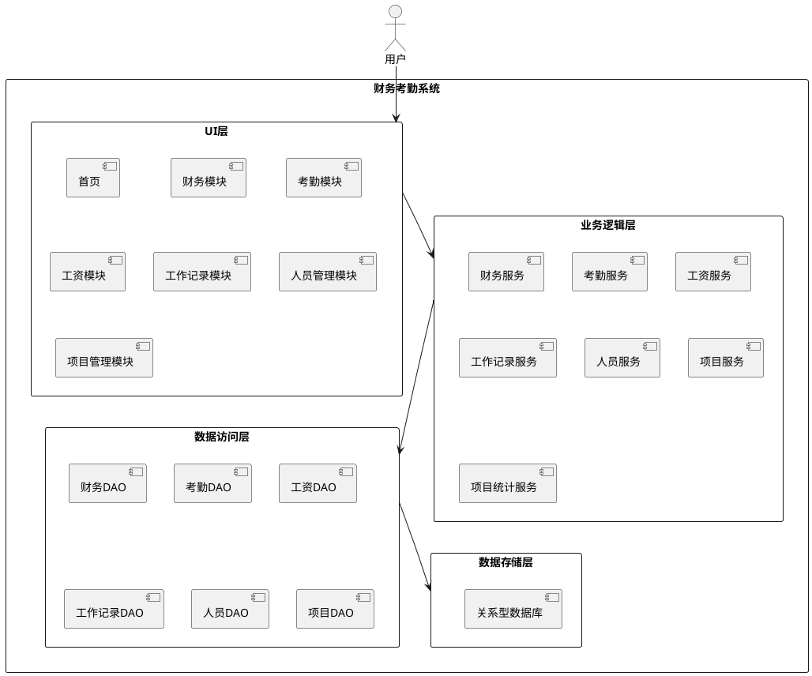

# **1. 实现模型**

## **1.1 上下文视图**



## **1.2 服务/组件总体架构**

本系统采用分层架构设计，分为以下几层：

1. **UI层**：负责用户界面展示和交互，使用ArkUI框架开发
2. **业务逻辑层**：负责核心业务逻辑处理，包括财务、考勤、工资等业务
3. **数据访问层**：负责数据的持久化操作
4. **数据存储层**：使用关系型数据库存储数据

## **1.3 实现设计文档**

### 1.3.1 技术栈

- **开发语言**：ArkTS
- **UI框架**：ArkUI
- **数据库**：关系型数据库
- **平台**：华为鸿蒙 4.0+

### 1.3.2 目录结构

```
FinanceAttendanceApp/
├── entry/src/main/
│   ├── ets/
│   │   ├── entryability/
│   │   │   └── EntryAbility.ets
│   │   ├── pages/
│   │   │   ├── Index.ets              # 首页
│   │   │   ├── FinancePage.ets        # 财务页面
│   │   │   ├── AttendancePage.ets     # 考勤页面
│   │   │   ├── SalaryPage.ets         # 工资页面
│   │   │   ├── WorkPage.ets           # 工作记录页面
│   │   │   ├── PersonnelPage.ets      # 人员管理页面
│   │   │   └── ProjectPage.ets        # 项目管理页面
│   │   ├── viewmodel/
│   │   │   ├── FinanceViewModel.ets   # 财务视图模型
│   │   │   ├── AttendanceViewModel.ets
│   │   │   ├── SalaryViewModel.ets
│   │   │   ├── WorkViewModel.ets
│   │   │   ├── PersonnelViewModel.ets
│   │   │   └── ProjectViewModel.ets
│   │   ├── model/
│   │   │   ├── FinanceRecord.ets
│   │   │   ├── AttendanceRecord.ets
│   │   │   ├── SalaryRecord.ets
│   │   │   ├── WorkRecord.ets
│   │   │   ├── Personnel.ets
│   │   │   └── Project.ets
│   │   ├── service/
│   │   │   ├── FinanceService.ets
│   │   │   ├── AttendanceService.ets
│   │   │   ├── SalaryService.ets
│   │   │   ├── WorkService.ets
│   │   │   ├── PersonnelService.ets
│   │   │   ├── ProjectService.ets
│   │   │   └── ProjectStatsService.ets
│   │   ├── dao/
│   │   │   ├── FinanceDao.ets
│   │   │   ├── AttendanceDao.ets
│   │   │   ├── SalaryDao.ets
│   │   │   ├── WorkDao.ets
│   │   │   ├── PersonnelDao.ets
│   │   │   └── ProjectDao.ets
│   │   ├── database/
│   │   │   └── DatabaseHelper.ets
│   │   └── utils/
│   │       ├── DateUtils.ets
│   │       └── ExportUtils.ets
│   └── module.json5
└── oh-package.json5
```

# **2. 接口设计**

## **2.1 总体设计**

系统采用MVVM架构模式，ViewModel负责业务逻辑处理，View负责UI展示，Model负责数据模型定义。

## **2.2 接口清单**

### 2.2.1 财务模块接口

```arkts
interface FinanceService {
  addRecord(record: FinanceRecord): Promise<boolean>
  updateRecord(record: FinanceRecord): Promise<boolean>
  deleteRecord(id: string): Promise<boolean>
  queryRecords(startDate: string, endDate: string, type: string): Promise<FinanceRecord[]>
  exportRecords(startDate: string, endDate: string): Promise<string>
}
```

### 2.2.2 考勤模块接口

```arkts
interface AttendanceService {
  clockIn(personId: string, period: string, projectId?: string, customStart?: string, customEnd?: string): Promise<boolean>
  clockOut(personId: string, period: string): Promise<boolean>
  queryRecords(startDate: string, endDate: string, personId?: string, projectId?: string): Promise<AttendanceRecord[]>
  calculateWorkHours(record: AttendanceRecord): number
}
```

### 2.2.3 工资模块接口

```arkts
interface SalaryService {
  addRecord(record: SalaryRecord): Promise<boolean>
  calculateDailySalary(personId: string, date: string): Promise<number>
  queryRecords(startDate: string, endDate: string, personId?: string): Promise<SalaryRecord[]>
  setDailySalary(personId: string, amount: number): Promise<boolean>
}
```

### 2.2.4 工作记录模块接口

```arkts
interface WorkService {
  addRecord(record: WorkRecord): Promise<boolean>
  updateRecord(record: WorkRecord): Promise<boolean>
  deleteRecord(id: string): Promise<boolean>
  queryRecords(startDate: string, endDate: string, personId?: string): Promise<WorkRecord[]>
}
```

### 2.2.5 人员管理模块接口

```arkts
interface PersonnelService {
  addPerson(person: Personnel): Promise<boolean>
  updatePerson(person: Personnel): Promise<boolean>
  deletePerson(id: string): Promise<boolean>
  queryAllPersons(): Promise<Personnel[]>
  getPersonById(id: string): Promise<Personnel | null>
}
```

### 2.2.6 项目管理模块接口

```arkts
interface ProjectService {
  addProject(project: Project): Promise<boolean>
  updateProject(project: Project): Promise<boolean>
  deleteProject(id: string): Promise<boolean>
  queryAllProjects(): Promise<Project[]>
  getProjectById(id: string): Promise<Project | null>
}
```

### 2.2.7 项目统计模块接口

```arkts
interface ProjectStatsService {
  getProjectPersonStats(projectId: string): Promise<ProjectPersonStats[]>
  getProjectExpenseStats(projectId: string): Promise<ProjectExpenseStats>
}

interface ProjectPersonStats {
  personId: string
  personName: string
  workDays: number
  totalHours: number
}

interface ProjectExpenseStats {
  materialCost: number
  transportCost: number
  officeCost: number
  livingCost: number
  totalCost: number
}
```

# **3. 数据模型**

## **3.1 设计目标**

使用关系型数据库存储所有业务数据，确保数据的一致性和可靠性。每个业务实体对应一张数据表。

## **3.2 模型实现**

### 3.2.1 财务记录表（finance_record）

| 字段名 | 类型 | 说明 | 约束 |
|--------|------|------|------|
| id | TEXT | 主键ID | PRIMARY KEY |
| record_type | TEXT | 记录类型 | NOT NULL |
| amount | REAL | 金额 | NOT NULL |
| date | TEXT | 日期 | NOT NULL |
| project_id | TEXT | 项目ID | - |
| project_name | TEXT | 项目名称 | - |
| remark | TEXT | 备注 | - |
| create_time | TEXT | 创建时间 | NOT NULL |

### 3.2.2 考勤记录表（attendance_record）

| 字段名 | 类型 | 说明 | 约束 |
|--------|------|------|------|
| id | TEXT | 主键ID | PRIMARY KEY |
| person_id | TEXT | 人员ID | NOT NULL |
| project_id | TEXT | 项目ID | - |
| clock_date | TEXT | 打卡日期 | NOT NULL |
| morning_start | TEXT | 上午上班时间 | - |
| morning_end | TEXT | 上午下班时间 | - |
| morning_hours | REAL | 上午工作时长 | - |
| afternoon_start | TEXT | 下午上班时间 | - |
| afternoon_end | TEXT | 下午下班时间 | - |
| afternoon_hours | REAL | 下午工作时长 | - |
| overtime_start | TEXT | 加班开始时间 | - |
| overtime_end | TEXT | 加班结束时间 | - |
| overtime_hours | REAL | 加班工作时长 | - |
| custom_periods | TEXT | 自定义时段JSON | - |
| total_hours | REAL | 总工作时长 | - |
| create_time | TEXT | 创建时间 | NOT NULL |

### 3.2.3 工资记录表（salary_record）

| 字段名 | 类型 | 说明 | 约束 |
|--------|------|------|------|
| id | TEXT | 主键ID | PRIMARY KEY |
| person_id | TEXT | 人员ID | NOT NULL |
| pay_date | TEXT | 发放日期 | NOT NULL |
| work_days | INTEGER | 工作天数 | NOT NULL |
| daily_salary | REAL | 日工资标准 | NOT NULL |
| should_pay | REAL | 应发工资 | NOT NULL |
| actual_pay | REAL | 实发工资 | - |
| remark | TEXT | 备注 | - |
| create_time | TEXT | 创建时间 | NOT NULL |

### 3.2.4 人员信息表（personnel）

| 字段名 | 类型 | 说明 | 约束 |
|--------|------|------|------|
| id | TEXT | 主键ID | PRIMARY KEY |
| name | TEXT | 姓名 | NOT NULL |
| person_type | TEXT | 人员类型 | NOT NULL |
| reference_salary | REAL | 参考日工资标准 | - |
| phone | TEXT | 电话 | - |
| join_date | TEXT | 入职日期 | - |
| create_time | TEXT | 创建时间 | NOT NULL |

### 3.2.5 工作记录表（work_record）

| 字段名 | 类型 | 说明 | 约束 |
|--------|------|------|------|
| id | TEXT | 主键ID | PRIMARY KEY |
| person_id | TEXT | 人员ID | NOT NULL |
| work_date | TEXT | 工作日期 | NOT NULL |
| work_content | TEXT | 工作内容 | NOT NULL |
| project_id | TEXT | 项目ID | - |
| create_time | TEXT | 创建时间 | NOT NULL |

### 3.2.6 工程项目表（project）

| 字段名 | 类型 | 说明 | 约束 |
|--------|------|------|------|
| id | TEXT | 主键ID | PRIMARY KEY |
| name | TEXT | 项目名称 | NOT NULL |
| start_date | TEXT | 开始日期 | NOT NULL |
| end_date | TEXT | 结束日期 | - |
| address | TEXT | 项目地址 | - |
| customer_name | TEXT | 客户姓名 | - |
| phone | TEXT | 联系电话 | - |
| contract_amount | REAL | 合同金额 | - |
| status | TEXT | 项目状态 | NOT NULL |
| remark | TEXT | 备注 | - |
| create_time | TEXT | 创建时间 | NOT NULL |

### 3.2.7 数据模型定义

```arkts
@Observed
export class FinanceRecord {
  id: string = ''
  recordType: string = '' // 工程收支、交通费用、办公用品、生活食材、工资发放
  amount: number = 0
  date: string = ''
  projectId: string = ''
  projectName: string = ''
  remark: string = ''
  createTime: string = ''
}

@Observed
export class AttendanceRecord {
  id: string = ''
  personId: string = ''
  projectId: string = ''
  clockDate: string = ''
  morningStart: string = ''
  morningEnd: string = ''
  morningHours: number = 0
  afternoonStart: string = ''
  afternoonEnd: string = ''
  afternoonHours: number = 0
  overtimeStart: string = ''
  overtimeEnd: string = ''
  overtimeHours: number = 0
  customPeriods: string = '' // JSON字符串
  totalHours: number = 0
  createTime: string = ''
}

export interface CustomPeriod {
  start: string
  end: string
  hours: number
}

@Observed
export class SalaryRecord {
  id: string = ''
  personId: string = ''
  payDate: string = ''
  workDays: number = 0
  dailySalary: number = 0
  shouldPay: number = 0
  actualPay: number = 0
  remark: string = ''
  createTime: string = ''
}

@Observed
export class Personnel {
  id: string = ''
  name: string = ''
  personType: string = '' // 固定员工、临时工
  referenceSalary: number = 0 // 参考日工资标准
  phone: string = ''
  joinDate: string = ''
  createTime: string = ''
}

@Observed
export class WorkRecord {
  id: string = ''
  personId: string = ''
  workDate: string = ''
  workContent: string = ''
  projectId: string = ''
  createTime: string = ''
}

@Observed
export class Project {
  id: string = ''
  name: string = ''
  startDate: string = ''
  endDate: string = ''
  address: string = ''
  customerName: string = ''
  phone: string = ''
  contractAmount: number = 0
  status: string = '' // 进行中、已完成、已暂停
  remark: string = ''
  createTime: string = ''
}

export interface ProjectPersonStats {
  personId: string
  personName: string
  workDays: number
  totalHours: number
}

export interface ProjectExpenseStats {
  materialCost: number
  transportCost: number
  officeCost: number
  livingCost: number
  totalCost: number
}
```
  projectId: string = ''
  createTime: string = ''
}
```