# **1. 组件定位**

## **1.1 核心职责**

本组件负责为室内装修行业从业者提供财务记录与考勤管理的移动端应用，实现收支管理、费用追踪、多时段考勤、按天工资计算和工作内容记录的数字化。

## **1.2 核心输入**

1. 用户的财务记录操作（工程收支、交通费用、办公用品、生活食材、工资发放等）
2. 用户的考勤打卡操作（上午、下午、加班、自定义时间）
3. 用户的工作内容记录操作
4. 用户的查询和筛选请求
5. 用户的导出操作

## **1.3 核心输出**

1. 财务记录的保存结果
2. 考勤记录的保存结果（包含多时段时长）
3. 工资计算结果
4. 工作内容的保存结果
5. 查询结果展示
6. 数据导出文件

## **1.4 职责边界**

1. 不负责与外部系统的数据同步
2. 不负责多人协同管理
3. 不负责云端数据备份
4. 不负责复杂的财务报表生成

# **2. 领域术语**

**工程收支**
: 记录装修工程项目的收入和支出，包括合同款项、材料费、人工费等。

**工程项目**
: 装修项目的基本信息，包括项目名称、开始日期、结束日期等。

**项目考勤关联**
: 考勤记录与工程项目的关联关系，用于统计项目人员工时。

**项目费用汇总**
: 自动汇总项目的所有费用，包括材料费、运输费等。

**交通费用**
: 记录因工作产生的交通相关费用，包括油费、过路费、停车费等。

**办公用品**
: 记录工作中使用的办公用品采购费用。

**生活食材**
: 记录工作期间的生活开支，包括餐饮、食材采购等。

**考勤记录**
: 记录人员的上午、下午、加班及自定义时间的打卡时间和工作时长。

**工作内容**
: 记录当日完成的工作任务和内容摘要。

**工资发放**
: 记录人员工资发放，按天计算日工资。

**日工资**
: 根据人员当日工作时长计算应得工资。

# **3. 角色与边界**

## **3.1 核心角色**

1. **项目负责人**：负责管理工程项目、记录收支、查看考勤、发放工资、查看工作内容
2. **施工人员**：负责打卡考勤、记录工作内容

## **3.2 外部系统**

无外部系统依赖。

## **3.3 交互上下文**

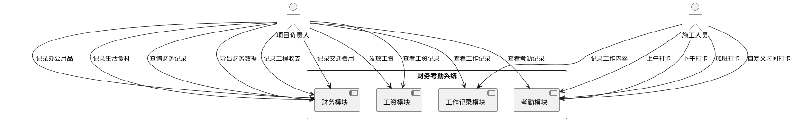

# **4. DFX约束**

## **4.1 性能**

1. 单条记录保存响应时间不超过 1 秒
2. 查询响应时间不超过 2 秒
3. 导出 1000 条记录不超过 10 秒
4. 工资计算响应时间不超过 2 秒

## **4.2 可靠性**

1. 数据持久化可靠性 99.9%
2. 应用崩溃后数据不丢失

## **4.3 安全性**

1. 应用启动需进行身份验证（PIN码或生物识别）
2. 敏感数据本地加密存储

## **4.4 可维护性**

1. 支持数据备份与恢复
2. 支持数据导出为 Excel 格式

## **4.5 兼容性**

1. 适配华为鸿蒙 4.0 及以上版本

# **5. 核心能力**

## **5.1 工程收支管理**

### **5.1.1 业务规则**

1. **工程收入记录**：用户可以记录工程项目的收入信息
   a. 验收条件：[用户输入收入金额、项目名称、日期] → [系统保存收入记录]

2. **工程支出记录**：用户可以记录工程项目的支出信息
   a. 验收条件：[用户输入支出金额、支出类型、项目名称、日期] → [系统保存支出记录]

3. **支出类型分类**：系统支持多种支出类型
   a. 验收条件：[用户选择支出类型] → [系统显示预定义类型列表]

4. **禁止项**：不允许删除已确认的收支记录
   a. 验收条件：[用户尝试删除已确认记录] → [系统提示不允许删除]

### **5.1.2 交互流程**

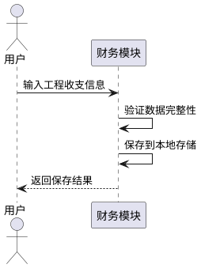

### **5.1.3 异常场景**

1. **金额格式错误**
   a. 触发条件：[用户输入非数字金额]
   b. 系统行为：[提示金额格式错误]
   c. 用户感知：[显示"请输入有效的金额"提示]

2. **必填项缺失**
   a. 触发条件：[用户未填写必填字段]
   b. 系统行为：[高亮缺失字段]
   c. 用户感知：[显示"请完善必填信息"提示]

## **5.2 交通费用管理**

### **5.2.1 业务规则**

1. **交通费用记录**：用户可以记录交通相关费用
   a. 验收条件：[用户输入费用金额、费用类型、日期] → [系统保存交通费用记录]

2. **费用类型分类**：支持油费、过路费、停车费等类型
   a. 验收条件：[用户选择费用类型] → [系统显示类型选项]

### **5.2.2 交互流程**

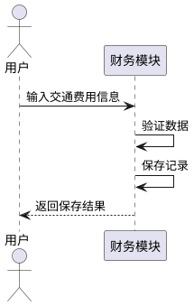

### **5.2.3 异常场景**

1. **金额超出范围**
   a. 触发条件：[用户输入负数金额]
   b. 系统行为：[提示金额必须大于0]
   c. 用户感知：[显示错误提示]

## **5.3 办公用品管理**

### **5.3.1 业务规则**

1. **办公用品记录**：用户可以记录办公用品采购费用
   a. 验收条件：[用户输入物品名称、数量、单价、日期] → [系统自动计算总价并保存]

### **5.3.2 交互流程**

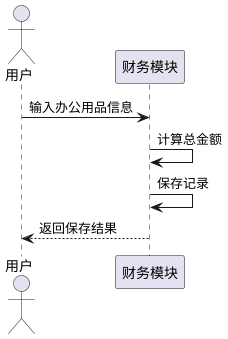

## **5.4 生活食材管理**

### **5.4.1 业务规则**

1. **生活食材记录**：用户可以记录生活食材采购费用
   a. 验收条件：[用户输入食材名称、金额、日期] → [系统保存记录]

### **5.4.2 交互流程**

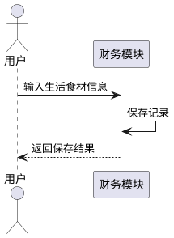

## **5.5 多时段考勤管理**

### **5.5.1 业务规则**

1. **上午打卡**：用户可以进行上午上班打卡
   a. 验收条件：[用户点击上午上班打卡] → [系统记录当前时间和位置]

2. **上午下班打卡**：用户可以进行上午下班打卡
   b. 验收条件：[用户点击上午下班打卡] → [系统记录当前时间并计算上午工作时长]

3. **下午打卡**：用户可以进行下午上班打卡
   a. 验收条件：[用户点击下午上班打卡] → [系统记录当前时间和位置]

4. **下午下班打卡**：用户可以进行下午下班打卡
   b. 验收条件：[用户点击下午下班打卡] → [系统记录当前时间并计算下午工作时长]

5. **加班打卡**：用户可以进行加班打卡
   a. 验收条件：[用户点击加班打卡] → [系统记录加班开始和结束时间并计算加班时长]

6. **自定义时间打卡**：用户可以自定义时间段进行打卡
   a. 验收条件：[用户输入开始和结束时间] → [系统保存自定义时段并计算时长]

7. **重复打卡限制**：同一时段同一天只能打一次卡
   a. 验收条件：[用户尝试重复打卡] → [系统提示已打卡]

8. **考勤项目关联**：考勤记录可以关联到具体项目
   a. 验收条件：[用户选择关联项目] → [系统保存项目关联关系]

9. **项目人员工时统计**：系统自动统计每个项目中每个人员的工作天数
   a. 验收条件：[用户查询项目统计] → [系统返回项目人员工时汇总]

### **5.5.2 交互流程**

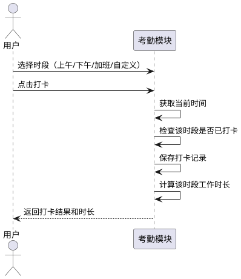

### **5.5.3 异常场景**

1. **下班打卡未上班**
   a. 触发条件：[用户未上班打卡直接下班]
   b. 系统行为：[提示请先上班打卡]
   c. 用户感知：[显示提示信息]

2. **自定义时间冲突**
   a. 触发条件：[用户输入的自定义时间段与已有时段重叠]
   b. 系统行为：[提示时间段冲突]
   c. 用户感知：[显示错误提示]

## **5.6 工程项目管理**

### **5.6.1 业务规则**

1. **项目创建**：用户可以创建新的工程项目
   a. 验收条件：[用户输入项目名称、开始日期、结束日期] → [系统保存项目信息]

2. **项目信息修改**：用户可以修改项目信息
   a. 验收条件：[用户更新项目信息] → [系统保存修改]

3. **项目删除**：用户可以删除项目
   a. 验收条件：[用户删除项目] → [系统删除项目及相关数据]

### **5.6.2 交互流程**

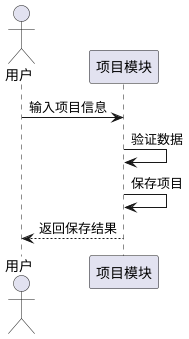

## **5.7 项目统计管理**

### **5.7.1 业务规则**

1. **项目人员工时统计**：系统自动统计项目中每个人员的工作天数和总天数
   a. 验收条件：[用户查询项目统计] → [系统返回人员工时汇总]

2. **项目费用自动汇总**：系统自动汇总项目的所有费用
   a. 验收条件：[用户查询项目费用] → [系统返回费用汇总（材料费、运输费等）]

3. **项目综合统计**：系统提供项目的综合统计信息
   a. 验收条件：[用户查看项目详情] → [系统显示人员工时和费用汇总]

### **5.7.2 交互流程**

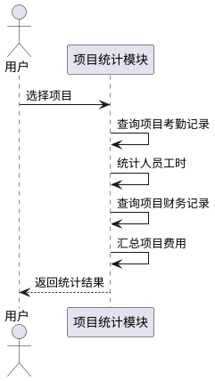

## **5.8 工资发放管理**

### **5.8.1 业务规则**

1. **工资发放记录**：用户可以记录工资发放，支持灵活的日工资标准
   a. 验收条件：[用户选择人员、日期、工作天数、日工资标准] → [系统计算总额并保存]

2. **日工资标准灵活设置**：工资标准可以在发放工资时动态设置，不固定
   a. 验收条件：[用户输入当日或当期的日工资金额] → [系统保存到工资记录中]

3. **人员类型区分**：系统支持固定员工和临时工两种类型
   a. 验收条件：[用户创建人员时选择类型] → [系统保存人员类型]

4. **固定员工参考标准**：固定员工可以设置参考日工资标准，用于快速填充
   a. 验收条件：[用户设置参考标准] → [系统保存到人员信息]

5. **临时工无固定标准**：临时工每次发放工资时都需要输入日工资标准
   a. 验收条件：[用户为临时工发放工资] → [系统要求输入日工资标准]

6. **工资查询**：用户可以按人员、日期范围查询工资发放记录
   a. 验收条件：[用户设置查询条件] → [系统返回工资记录]

### **5.8.2 交互流程**

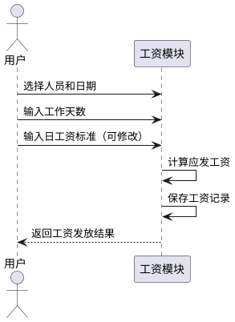

## **5.9 工作内容记录**

### **5.9.1 业务规则**

1. **工作内容记录**：用户可以记录当日工作内容
   a. 验收条件：[用户输入工作日期、内容描述] → [系统保存工作记录]

2. **工作内容关联**：工作记录可以关联到具体项目
   a. 验收条件：[用户选择关联项目] → [系统保存关联关系]

### **5.9.2 交互流程**

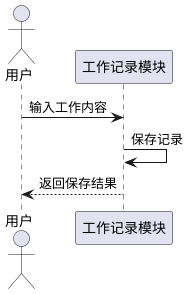

## **5.10 数据查询与导出**

### **5.10.1 业务规则**

1. **财务记录查询**：用户可以按日期、类型、项目筛选财务记录
   a. 验收条件：[用户设置筛选条件] → [系统返回匹配记录]

2. **考勤记录查询**：用户可以按日期范围、人员、项目查询考勤记录
   a. 验收条件：[用户选择日期范围和人员] → [系统返回考勤统计]

3. **工资记录查询**：用户可以按人员、日期范围查询工资记录
   a. 验收条件：[用户设置查询条件] → [系统返回工资汇总]

4. **项目统计查询**：用户可以查询项目的综合统计信息
   a. 验收条件：[用户选择项目] → [系统返回人员工时和费用汇总]

5. **数据导出**：用户可以导出财务、考勤、工资、项目统计数据
   a. 验收条件：[用户选择导出类型和日期范围] → [系统生成Excel文件]

### **5.10.2 交互流程**

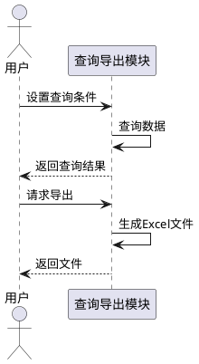

# **6. 数据约束**

## **6.1 财务记录**

1. **记录ID**：唯一标识符，必须唯一
2. **记录类型**：工程收支、交通费用、办公用品、生活食材、工资发放，必填
3. **金额**：必须大于0，保留两位小数
4. **日期**：格式为YYYY-MM-DD，必填
5. **项目名称**：工程收支类型必填，其他类型可选
6. **备注**：可选，最大500字符

## **6.2 考勤记录**

1. **记录ID**：唯一标识符，必须唯一
2. **人员ID**：必填，关联到人员信息
3. **项目ID**：可选，关联到工程项目
4. **打卡日期**：格式为YYYY-MM-DD，必填
5. **上午上班时间**：格式为YYYY-MM-DD HH:mm:ss，可选
6. **上午下班时间**：格式为YYYY-MM-DD HH:mm:ss，可选
7. **上午工作时长**：自动计算，单位为小时
8. **下午上班时间**：格式为YYYY-MM-DD HH:mm:ss，可选
9. **下午下班时间**：格式为YYYY-MM-DD HH:mm:ss，可选
10. **下午工作时长**：自动计算，单位为小时
11. **加班开始时间**：格式为YYYY-MM-DD HH:mm:ss，可选
12. **加班结束时间**：格式为YYYY-MM-DD HH:mm:ss，可选
13. **加班工作时长**：自动计算，单位为小时
14. **自定义时段列表**：JSON数组，包含多个自定义时段
15. **总工作时长**：自动计算所有时段总和，单位为小时

## **6.3 工资记录**

1. **记录ID**：唯一标识符，必须唯一
2. **人员ID**：必填，关联到人员信息
3. **发放日期**：格式为YYYY-MM-DD，必填
4. **工作天数**：必填，必须大于0
5. **日工资标准**：必填，必须大于0，保留两位小数
6. **应发工资**：自动计算，工作天数 × 日工资标准
7. **实发工资**：可选，默认等于应发工资
8. **备注**：可选，最大500字符

## **6.4 人员信息**

1. **人员ID**：唯一标识符，必须唯一
2. **姓名**：必填，最大50字符
3. **人员类型**：必填，固定员工/临时工
4. **参考日工资标准**：可选，仅固定员工使用，必须大于0，保留两位小数
5. **电话**：可选，最大20字符
6. **入职日期**：格式为YYYY-MM-DD，可选

## **6.5 工作记录**

1. **记录ID**：唯一标识符，必须唯一
2. **人员ID**：必填，关联到人员信息
3. **工作日期**：格式为YYYY-MM-DD，必填
4. **工作内容**：必填，最大1000字符
5. **项目ID**：可选，关联到工程项目
6. **创建时间**：自动记录当前时间

## **6.6 工程项目**

1. **项目ID**：唯一标识符，必须唯一
2. **项目名称**：必填，最大100字符
3. **开始日期**：格式为YYYY-MM-DD，必填
4. **结束日期**：格式为YYYY-MM-DD，可选
5. **项目地址**：可选，最大200字符
6. **客户姓名**：可选，最大50字符
7. **联系电话**：可选，最大20字符
8. **合同金额**：可选，必须大于0，保留两位小数
9. **项目状态**：必填，进行中/已完成/已暂停
10. **备注**：可选，最大500字符
11. **创建时间**：自动记录当前时间
6. **创建时间**：自动记录当前时间