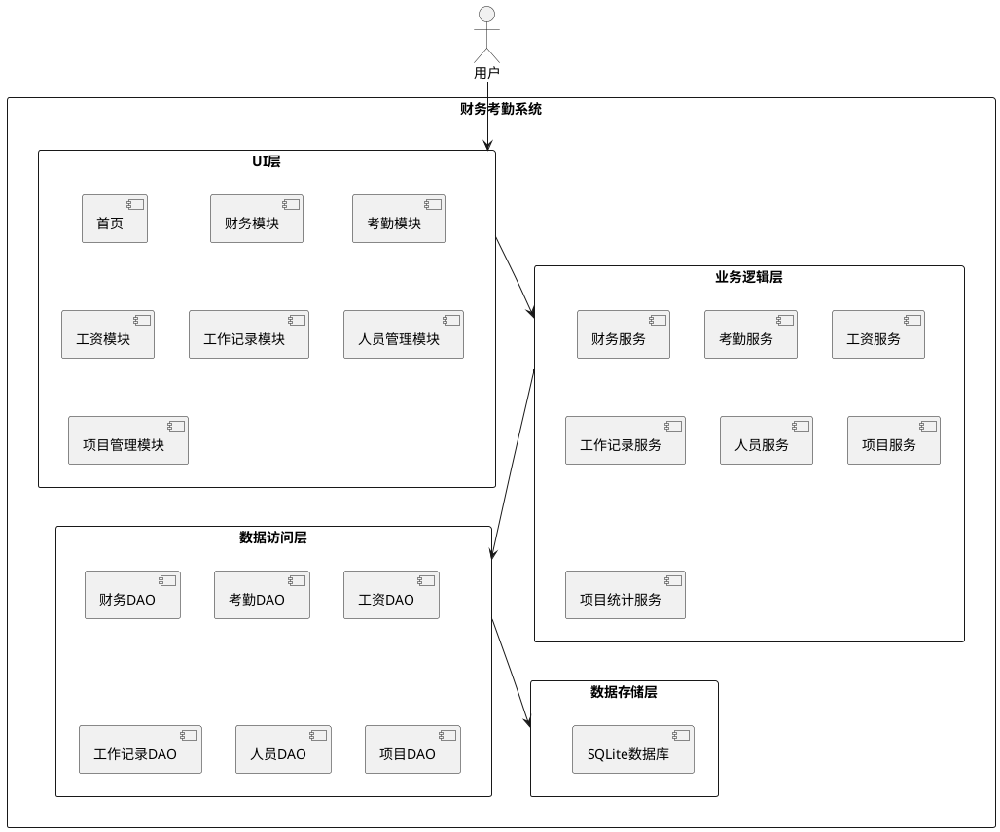

# **1. 实现模型**

## **1.1 上下文视图**



## **1.2 服务/组件总体架构**

本系统采用分层架构设计，分为以下几层：

1. **UI层**：负责用户界面展示和交互，使用Jetpack Compose或XML布局开发
2. **业务逻辑层**：负责核心业务逻辑处理，包括财务、考勤、工资等业务
3. **数据访问层**：负责数据的持久化操作
4. **数据存储层**：使用SQLite数据库存储数据

## **1.3 实现设计文档**

### 1.3.1 技术栈

- **开发语言**：Kotlin
- **UI框架**：Jetpack Compose / XML
- **数据库**：Room (SQLite)
- **异步处理**：Kotlin Coroutines + Flow
- **依赖注入**：Hilt
- **最小SDK版本**：Android 8.0 (API 26)

### 1.3.2 目录结构

```
FinanceAttendanceAndroid/
├── app/
│   └── src/
│       └── main/
│           ├── java/com/financeattendance/
│           │   ├── ui/
│           │   │   ├── theme/
│           │   │   ├── screen/
│           │   │   │   ├── HomeScreen.kt
│           │   │   │   ├── FinanceScreen.kt
│           │   │   │   ├── AttendanceScreen.kt
│           │   │   │   ├── SalaryScreen.kt
│           │   │   │   ├── WorkScreen.kt
│           │   │   │   ├── PersonnelScreen.kt
│           │   │   │   └── ProjectScreen.kt
│           │   │   └── component/
│           │   ├── viewmodel/
│           │   │   ├── FinanceViewModel.kt
│           │   │   ├── AttendanceViewModel.kt
│           │   │   ├── SalaryViewModel.kt
│           │   │   ├── WorkViewModel.kt
│           │   │   ├── PersonnelViewModel.kt
│           │   │   └── ProjectViewModel.kt
│           │   ├── data/
│           │   │   ├── entity/
│           │   │   │   ├── FinanceRecord.kt
│           │   │   │   ├── AttendanceRecord.kt
│           │   │   │   ├── SalaryRecord.kt
│           │   │   │   ├── WorkRecord.kt
│           │   │   │   ├── Personnel.kt
│           │   │   │   └── Project.kt
│           │   │   ├── dao/
│           │   │   │   ├── FinanceDao.kt
│           │   │   │   ├── AttendanceDao.kt
│           │   │   │   ├── SalaryDao.kt
│           │   │   │   ├── WorkDao.kt
│           │   │   │   ├── PersonnelDao.kt
│           │   │   │   └── ProjectDao.kt
│           │   │   ├── database/
│           │   │   │   └── AppDatabase.kt
│           │   │   └── repository/
│           │   │       ├── FinanceRepository.kt
│           │   │       ├── AttendanceRepository.kt
│           │   │       ├── SalaryRepository.kt
│           │   │       ├── WorkRepository.kt
│           │   │       ├── PersonnelRepository.kt
│           │   │       └── ProjectRepository.kt
│           │   ├── domain/
│           │   │   ├── usecase/
│           │   │   ├── service/
│           │   │   └── model/
│           │   ├── di/
│           │   └── MainActivity.kt
│           ├── res/
│           └── AndroidManifest.xml
└── build.gradle.kts
```

# **2. 接口设计**

## **2.1 总体设计**

系统采用MVVM架构模式，ViewModel负责业务逻辑处理，View负责UI展示，Model负责数据模型定义。使用Repository模式分离数据源。

## **2.2 接口清单**

### 2.2.1 财务模块接口

```kotlin
interface FinanceRepository {
    suspend fun addRecord(record: FinanceRecord): Boolean
    suspend fun updateRecord(record: FinanceRecord): Boolean
    suspend fun deleteRecord(id: String): Boolean
    suspend fun queryRecords(startDate: String, endDate: String, type: String): List<FinanceRecord>
    suspend fun exportRecords(startDate: String, endDate: String): String
}
```

### 2.2.2 考勤模块接口

```kotlin
interface AttendanceRepository {
    suspend fun clockIn(personId: String, period: String, projectId: String?, customStart: String?, customEnd: String?): Boolean
    suspend fun clockOut(personId: String, period: String): Boolean
    suspend fun queryRecords(startDate: String, endDate: String, personId: String?, projectId: String?): List<AttendanceRecord>
    fun calculateWorkHours(record: AttendanceRecord): Double
}
```

### 2.2.3 工资模块接口

```kotlin
interface SalaryRepository {
    suspend fun addRecord(record: SalaryRecord): Boolean
    suspend fun queryRecords(personId: String?): List<SalaryRecord>
}
```

### 2.2.4 工作记录模块接口

```kotlin
interface WorkRepository {
    suspend fun addRecord(record: WorkRecord): Boolean
    suspend fun updateRecord(record: WorkRecord): Boolean
    suspend fun deleteRecord(id: String): Boolean
    suspend fun queryRecords(personId: String?): List<WorkRecord>
}
```

### 2.2.5 人员管理模块接口

```kotlin
interface PersonnelRepository {
    suspend fun addPerson(person: Personnel): Boolean
    suspend fun updatePerson(person: Personnel): Boolean
    suspend fun deletePerson(id: String): Boolean
    suspend fun queryAllPersons(): List<Personnel>
    suspend fun getPersonById(id: String): Personnel?
}
```

### 2.2.6 项目管理模块接口

```kotlin
interface ProjectRepository {
    suspend fun addProject(project: Project): Boolean
    suspend fun updateProject(project: Project): Boolean
    suspend fun deleteProject(id: String): Boolean
    suspend fun queryAllProjects(): List<Project>
    suspend fun getProjectById(id: String): Project?
}
```

### 2.2.7 项目统计模块接口

```kotlin
interface ProjectStatsService {
    suspend fun getProjectPersonStats(projectId: String): List<ProjectPersonStats>
    suspend fun getProjectExpenseStats(projectId: String): ProjectExpenseStats
}

data class ProjectPersonStats(
    val personId: String,
    val personName: String,
    val workDays: Int,
    val totalHours: Double
)

data class ProjectExpenseStats(
    val materialCost: Double,
    val transportCost: Double,
    val officeCost: Double,
    val livingCost: Double,
    val totalCost: Double
)
```

# **3. 数据模型**

## **3.1 设计目标**

使用Room数据库（基于SQLite）存储所有业务数据，确保数据的一致性和可靠性。每个业务实体对应一张数据表。

## **3.2 模型实现**

### 3.2.1 财务记录表（finance_record）

| 字段名 | 类型 | 说明 | 约束 |
|--------|------|------|------|
| id | TEXT | 主键ID | PRIMARY KEY |
| record_type | TEXT | 记录类型 | NOT NULL |
| amount | REAL | 金额 | NOT NULL |
| date | TEXT | 日期 | NOT NULL |
| project_id | TEXT | 项目ID | - |
| project_name | TEXT | 项目名称 | - |
| remark | TEXT | 备注 | - |
| create_time | TEXT | 创建时间 | NOT NULL |

### 3.2.2 考勤记录表（attendance_record）

| 字段名 | 类型 | 说明 | 约束 |
|--------|------|------|------|
| id | TEXT | 主键ID | PRIMARY KEY |
| person_id | TEXT | 人员ID | NOT NULL |
| project_id | TEXT | 项目ID | - |
| clock_date | TEXT | 打卡日期 | NOT NULL |
| morning_start | TEXT | 上午上班时间 | - |
| morning_end | TEXT | 上午下班时间 | - |
| morning_hours | REAL | 上午工作时长 | - |
| afternoon_start | TEXT | 下午上班时间 | - |
| afternoon_end | TEXT | 下午下班时间 | - |
| afternoon_hours | REAL | 下午工作时长 | - |
| overtime_start | TEXT | 加班开始时间 | - |
| overtime_end | TEXT | 加班结束时间 | - |
| overtime_hours | REAL | 加班工作时长 | - |
| custom_periods | TEXT | 自定义时段JSON | - |
| total_hours | REAL | 总工作时长 | - |
| create_time | TEXT | 创建时间 | NOT NULL |

### 3.2.3 工资记录表（salary_record）

| 字段名 | 类型 | 说明 | 约束 |
|--------|------|------|------|
| id | TEXT | 主键ID | PRIMARY KEY |
| person_id | TEXT | 人员ID | NOT NULL |
| pay_date | TEXT | 发放日期 | NOT NULL |
| work_days | INTEGER | 工作天数 | NOT NULL |
| daily_salary | REAL | 日工资标准 | NOT NULL |
| should_pay | REAL | 应发工资 | NOT NULL |
| actual_pay | REAL | 实发工资 | - |
| remark | TEXT | 备注 | - |
| create_time | TEXT | 创建时间 | NOT NULL |

### 3.2.4 人员信息表（personnel）

| 字段名 | 类型 | 说明 | 约束 |
|--------|------|------|------|
| id | TEXT | 主键ID | PRIMARY KEY |
| name | TEXT | 姓名 | NOT NULL |
| person_type | TEXT | 人员类型 | NOT NULL |
| reference_salary | REAL | 参考日工资标准 | - |
| phone | TEXT | 电话 | - |
| join_date | TEXT | 入职日期 | - |
| create_time | TEXT | 创建时间 | NOT NULL |

### 3.2.5 工作记录表（work_record）

| 字段名 | 类型 | 说明 | 约束 |
|--------|------|------|------|
| id | TEXT | 主键ID | PRIMARY KEY |
| person_id | TEXT | 人员ID | NOT NULL |
| work_date | TEXT | 工作日期 | NOT NULL |
| work_content | TEXT | 工作内容 | NOT NULL |
| project_id | TEXT | 项目ID | - |
| create_time | TEXT | 创建时间 | NOT NULL |

### 3.2.6 工程项目表（project）

| 字段名 | 类型 | 说明 | 约束 |
|--------|------|------|------|
| id | TEXT | 主键ID | PRIMARY KEY |
| name | TEXT | 项目名称 | NOT NULL |
| start_date | TEXT | 开始日期 | NOT NULL |
| end_date | TEXT | 结束日期 | - |
| address | TEXT | 项目地址 | - |
| customer_name | TEXT | 客户姓名 | - |
| phone | TEXT | 联系电话 | - |
| contract_amount | REAL | 合同金额 | - |
| status | TEXT | 项目状态 | NOT NULL |
| remark | TEXT | 备注 | - |
| create_time | TEXT | 创建时间 | NOT NULL |

### 3.2.7 数据模型定义

```kotlin
@Entity(tableName = "finance_record")
data class FinanceRecord(
    @PrimaryKey val id: String = UUID.randomUUID().toString(),
    @ColumnInfo(name = "record_type") val recordType: String, // 工程收支、交通费用、办公用品、生活食材、工资发放
    @ColumnInfo(name = "amount") val amount: Double,
    @ColumnInfo(name = "date") val date: String,
    @ColumnInfo(name = "project_id") val projectId: String? = null,
    @ColumnInfo(name = "project_name") val projectName: String? = null,
    @ColumnInfo(name = "remark") val remark: String? = null,
    @ColumnInfo(name = "create_time") val createTime: String
)

@Entity(tableName = "attendance_record")
data class AttendanceRecord(
    @PrimaryKey val id: String = UUID.randomUUID().toString(),
    @ColumnInfo(name = "person_id") val personId: String,
    @ColumnInfo(name = "project_id") val projectId: String? = null,
    @ColumnInfo(name = "clock_date") val clockDate: String,
    @ColumnInfo(name = "morning_start") val morningStart: String? = null,
    @ColumnInfo(name = "morning_end") val morningEnd: String? = null,
    @ColumnInfo(name = "morning_hours") val morningHours: Double = 0.0,
    @ColumnInfo(name = "afternoon_start") val afternoonStart: String? = null,
    @ColumnInfo(name = "afternoon_end") val afternoonEnd: String? = null,
    @ColumnInfo(name = "afternoon_hours") val afternoonHours: Double = 0.0,
    @ColumnInfo(name = "overtime_start") val overtimeStart: String? = null,
    @ColumnInfo(name = "overtime_end") val overtimeEnd: String? = null,
    @ColumnInfo(name = "overtime_hours") val overtimeHours: Double = 0.0,
    @ColumnInfo(name = "custom_periods") val customPeriods: String? = null, // JSON字符串
    @ColumnInfo(name = "total_hours") val totalHours: Double = 0.0,
    @ColumnInfo(name = "create_time") val createTime: String
)

data class CustomPeriod(
    val start: String,
    val end: String,
    val hours: Double
)

@Entity(tableName = "salary_record")
data class SalaryRecord(
    @PrimaryKey val id: String = UUID.randomUUID().toString(),
    @ColumnInfo(name = "person_id") val personId: String,
    @ColumnInfo(name = "pay_date") val payDate: String,
    @ColumnInfo(name = "work_days") val workDays: Int,
    @ColumnInfo(name = "daily_salary") val dailySalary: Double,
    @ColumnInfo(name = "should_pay") val shouldPay: Double,
    @ColumnInfo(name = "actual_pay") val actualPay: Double = 0.0,
    @ColumnInfo(name = "remark") val remark: String? = null,
    @ColumnInfo(name = "create_time") val createTime: String
)

@Entity(tableName = "personnel")
data class Personnel(
    @PrimaryKey val id: String = UUID.randomUUID().toString(),
    @ColumnInfo(name = "name") val name: String,
    @ColumnInfo(name = "person_type") val personType: String, // 固定员工、临时工
    @ColumnInfo(name = "reference_salary") val referenceSalary: Double = 0.0, // 参考日工资标准
    @ColumnInfo(name = "phone") val phone: String? = null,
    @ColumnInfo(name = "join_date") val joinDate: String? = null,
    @ColumnInfo(name = "create_time") val createTime: String
)

@Entity(tableName = "work_record")
data class WorkRecord(
    @PrimaryKey val id: String = UUID.randomUUID().toString(),
    @ColumnInfo(name = "person_id") val personId: String,
    @ColumnInfo(name = "work_date") val workDate: String,
    @ColumnInfo(name = "work_content") val workContent: String,
    @ColumnInfo(name = "project_id") val projectId: String? = null,
    @ColumnInfo(name = "create_time") val createTime: String
)

@Entity(tableName = "project")
data class Project(
    @PrimaryKey val id: String = UUID.randomUUID().toString(),
    @ColumnInfo(name = "name") val name: String,
    @ColumnInfo(name = "start_date") val startDate: String,
    @ColumnInfo(name = "end_date") val endDate: String? = null,
    @ColumnInfo(name = "address") val address: String? = null,
    @ColumnInfo(name = "customer_name") val customerName: String? = null,
    @ColumnInfo(name = "phone") val phone: String? = null,
    @ColumnInfo(name = "contract_amount") val contractAmount: Double = 0.0,
    @ColumnInfo(name = "status") val status: String, // 进行中、已完成、已暂停
    @ColumnInfo(name = "remark") val remark: String? = null,
    @ColumnInfo(name = "create_time") val createTime: String
)

data class ProjectPersonStats(
    val personId: String,
    val personName: String,
    val workDays: Int,
    val totalHours: Double
)

data class ProjectExpenseStats(
    val materialCost: Double,
    val transportCost: Double,
    val officeCost: Double,
    val livingCost: Double,
    val totalCost: Double
)
```
